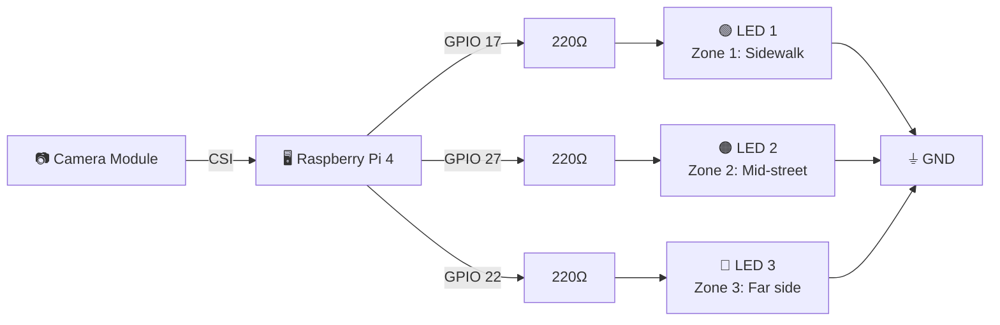
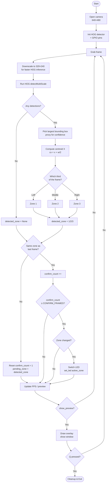
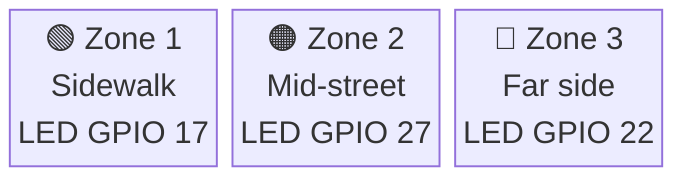

# System Diagrams

## Hardware Wiring

```mermaid
flowchart LR
    CAM["📷 Camera Module"]
    PI["🖥️ Raspberry Pi 4"]
    R1["220Ω"]
    R2["220Ω"]
    R3["220Ω"]
    LED1["🟢 LED 1\nZone 1: Sidewalk"]
    LED2["🟠 LED 2\nZone 2: Mid-street"]
    LED3["🔴 LED 3\nZone 3: Far side"]
    GND["⏚ GND"]

    CAM -->|CSI| PI
    PI -->|GPIO 17| R1 --> LED1 --> GND
    PI -->|GPIO 27| R2 --> LED2 --> GND
    PI -->|GPIO 22| R3 --> LED3 --> GND
```

---

## Detection Pipeline

```mermaid
flowchart TD
    A([Start]) --> B[Open camera\n640×480]
    B --> C[Init HOG detector\n+ GPIO pins]
    C --> D[Grab frame]
    D --> E[Downscale to 320×240\nfor faster HOG inference]
    E --> F[Run HOG detectMultiScale]
    F --> G{Any detections?}

    G -- No --> H[detected_zone = None]
    G -- Yes --> I[Pick largest bounding box\nproxy for confidence]
    I --> J[Compute centroid X\ncx = x + w/2]
    J --> K{Which third\nof the frame?}
    K -- Left --> Z1[Zone 1]
    K -- Middle --> Z2[Zone 2]
    K -- Right --> Z3[Zone 3]
    Z1 & Z2 & Z3 --> L[detected_zone = 1/2/3]

    H & L --> M{Same zone as\nlast frame?}
    M -- Yes --> N[confirm_count ++]
    M -- No --> O[Reset confirm_count = 1\npending_zone = detected_zone]
    O --> P[Update FPS / preview]

    N --> Q{confirm_count\n≥ CONFIRM_FRAMES?}
    Q -- No --> P
    Q -- Yes --> R{Zone changed?}
    R -- No --> P
    R -- Yes --> S[Switch LED\nset_led active_zone]
    S --> P

    P --> T{show_preview?}
    T -- Yes --> U[Draw overlay\nshow window]
    U --> V{Q pressed?}
    V -- No --> D
    V -- Yes --> W([Cleanup & Exit])
    T -- No --> D
```

---

## Zone Layout

```mermaid
block-beta
  columns 3
  z1["🟢 Zone 1\nSidewalk\nLED GPIO 17"]:1
  z2["🟠 Zone 2\nMid-street\nLED GPIO 27"]:1
  z3["🔴 Zone 3\nFar side\nLED GPIO 22"]:1
```
